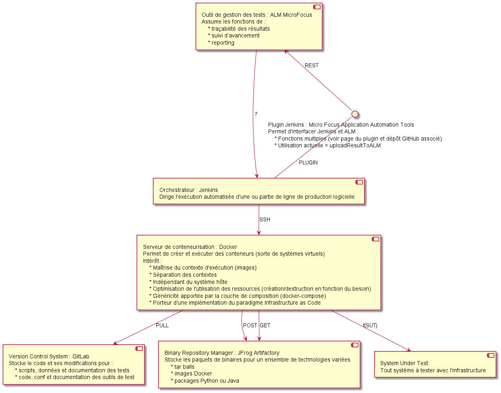

# ATLAS

## Schéma d'architecture



## Présentation du job générique de lancement d'une campagne de test sous Jenkins

La technologie utilisée, la configuration du lancement, les éléments du projet de test automatisés sont masqués.
Ces données sont portées par le fichier de description "docker_compose.yml" et l'arborescence du projet qui est imposée.

Il s'agit donc de télécharger, dans cet ordre :
* les éléments de la plateforme d'exécution, ici Docker
* les outils de tests utilisés dans la version souhaitée
* le projet d'automatisation avec les scripts et données de test

Les tests sont lancés à travers une seule commande "docker-compose up".

En fin d'exécution, la plateforme est détruite avec la commande générique "docker-compose down".
Les éléments souhaités sont conservés dans le contexte d'exécution de l'orchestrateur (Jenkins).
Le rapport est ensuite transmis au référentiel de test.

> Il s'agit d'un état intermédiaire.
> L'idée est de lancer les tests de façon générique à travers "docker-compose up".
> L'arborescence est donc à retravailler pour supprimer la navigation dans des répertoires spécifiques.
> Il faudra que le lancement se fasse depuis une arborescence générique, dans l'esprit des archétypes Maven (sans en reprendre la technologie). 

> Les données du référentiel de test doivent être variabilisées afin de rendre le job générique.
> On pourra ensuite les passer en argument à l'exécution de celui-ci. 
> Et, par exemple, ils pourront être utilisés en arguments d'un appel à l'API Jenkins.

> L'upload des résultats vers ALM ne fonctionne que sur des rapports Junit archivés dans le répertoire de build.
> D'où la présence de la fonction "archiveArtifacts" avant "uploadResultToALM".
> 
> Note : De mémoire, ce fonctionnement est hérité du plugin QC, aujourd'hui déprécié.

> Plugin pour interface ALM-Jenkins : [Micro Focus Application Automation Tools](https://plugins.jenkins.io/hp-application-automation-tools-plugin/) 

```Jenkinsfile
pipeline {
    agent {
        node {
            label 'docker'
        }
    }
    stages {
        stage("Test") {
            steps {
                sh 'wget https://github.com/bbuzens/atlas/archive/master.zip'
                sh 'unzip -o master.zip'
                sh 'rm -f master.zip*'
                sh 'cd atlas-master/docker/pytest; docker-compose up --build'
            }

            post {
                // If Maven was able to run the tests, even if some of the test
                // failed, record the test results and archive the jar file.
                success {
                    echo "SUCCESS"
                    sh 'cd atlas-master/docker/pytest; docker-compose down'
                    sh 'find . -name results.xml'
                    archiveArtifacts artifacts: '**/results.xml', followSymlinks: false
                    uploadResultToALM almTimeout:'30', almDomain: 'DOMAIN', almProject: 'PROJECT', almServerName: 'ALM_URL', almTestFolder: 'tmp_test', almTestSetFolder: 'tmp_testset', clientType: 'MyClient', credentialsId: 'CREDS', jenkinsServerUrl: 'http://jenkins.loc:8080', testingFramework: 'JUnit', testingResultFile: '**/results.xml', testingTool: 'PyTest'
                }
            }
        }
    }
}
```

